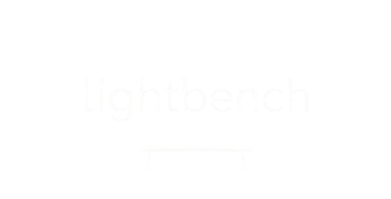

<div align='center'>
    <picture>
        <source media="(prefers-color-scheme: light)" srcset="docs/readme_assets/lightbench_logo_lightmode.png">
        
    </picture>
    <p>
        
        =3.11.3-blue">
        <!--  -->
        <br>
        
        
    </p>
</div>


# lightbench
*A lightweight benchmarking framework for LLMs.*


## Table of Contents
- [lightbench](#lightbench)
  - [Table of Contents](#table-of-contents)
  - [Overview](#overview)
  - [Key Features](#key-features)
  - [Installation](#installation)
  - [Usage](#usage)
  - [Project Structure](#project-structure)
  - [Contributing](#contributing)
  - [Citation](#citation)
  - [License](#license)

You can find the full **documentation** at [https://filipnaudot.github.io/lightbench](https://filipnaudot.github.io/lightbench/)

## Overview
**lightbench** is designed to offer both interactive and automated benchmarking for large language models, enabling comprehensive evaluation of code generation and question answering capabilities.

## Key Features
- **Human Evaluation:** Interactive chat interface.
- **Automatic Evaluations:** Automated tests for code and text outputs.
- **Extensible Architecture:** Easy integration of new evaluators and metrics.

## Installation
Follow these steps to set up the `lightbench` benchmarking framework:

**Step 1:** 

Install [PyTorch](https://pytorch.org/get-started/locally/) and select the appropriate installation command for your system, paying attention to your GPU type and CUDA compatibility.

Example (adjust according to your GPU):
```bash
pip install torch torchvision torchaudio --index-url https://download.pytorch.org/whl/cu118
```

**Step 2:** 

Install **lightbench**. Navigate to your cloned lightbench directory and run:
```bash
pip install -e .
```
This installs **lightbench** and its dependencies in editable mode.

> [!NOTE]  
> It is highly recommended to use a Python virtual environment (e.g., `venv` or `conda`) to manage dependencies and ensure a clean workspace.


**Step 3:**

Configure environment variables. Create a `.env` file in the project's root directory. Include only the keys relevant to your use case as described below:
```python
# Required if using OpenAI models
OPENAI_API_KEY=<your_openai_api_key_here>

# Required if using Mistral models
MISTRAL_API_KEY=<your_mistral_api_key_here>

# Required if downloading models from HuggingFace
HUGGINGFACE_TOKEN=<your_huggingface_token_here>

# Required if using the interactive chat interface (chat.py)
MODEL_NAME=<your_model_name_here>
```

> [!NOTE]  
> You only need to include each key **if you intend to use the corresponding feature**.


## Usage
- **Interactive Chat:**  
  Run `chat.py` to start the chat interface. This will use the model specified by `MODEL_NAME` in the `.env` file. Below is an example of a chat using [Llama-3.2-3B-Instruct](https://huggingface.co/meta-llama/Llama-3.2-3B-Instruct), running on a GTX 1080 TI.
  

- **Automated Evaluations:**  
  See examples in [`examples.ipynb`](examples.ipynb).

## Project Structure
- **data**: Benchmark datasets.
- **evaluators**: Modules for evaluation.
- **loaders**: Tools to load and manage models.
- **metric**: Available metrics for local and API based models.

## Contributing
We welcome contributions! Please see our [CONTRIBUTING.md](CONTRIBUTING.md) for guidelines on submitting issues, pull requests, and feature ideas.

## Citation
**Repository.**
If you use **lightbench** in your research, please cite the repository:
```bibtex
@misc{lightbench2025,
  author    = {Filip Naudot},
  title     = {lightbench},
  year      = {2025},
  howpublished = {\url{https://github.com/filipnaudot/lightbench}},
}
```

**[Paper](https://www.diva-portal.org/smash/get/diva2:1939196/FULLTEXT01.pdf#page=29).** If you refer to the research paper where this project was introduced, please cite:
```bibtex
@inproceedings{naudot2025performance,
  author    = {Filip Naudot},
  title     = {Performance and Computational Demands of LLMs: Impact of Model Size and Quantization},
  booktitle = {Proceedings of Umeå’s 28th Student Conference in Computing Science (USCCS 2025)},
  editor    = {Thomas Hellström},
  year      = {2025},
  publisher = {Umeå University, Sweden},
  note      = {Branch \texttt{conf-paper} used for paper results},
}
```

## License
Distributed under the MIT License. See `LICENSE` for more information.
